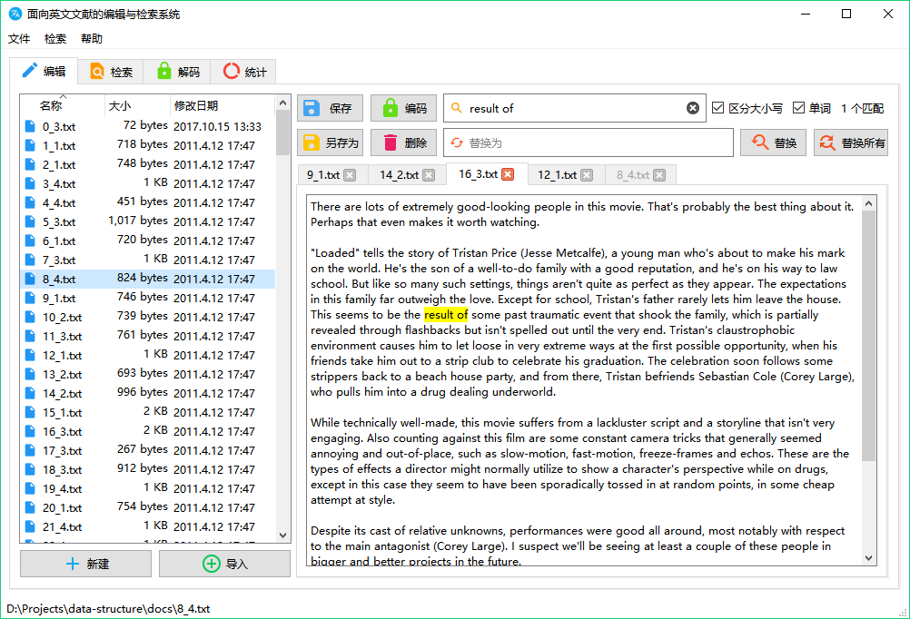
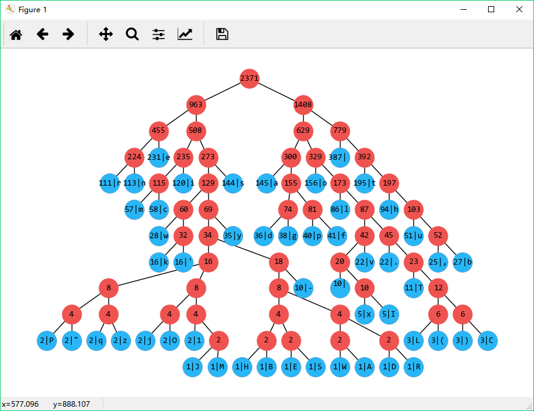
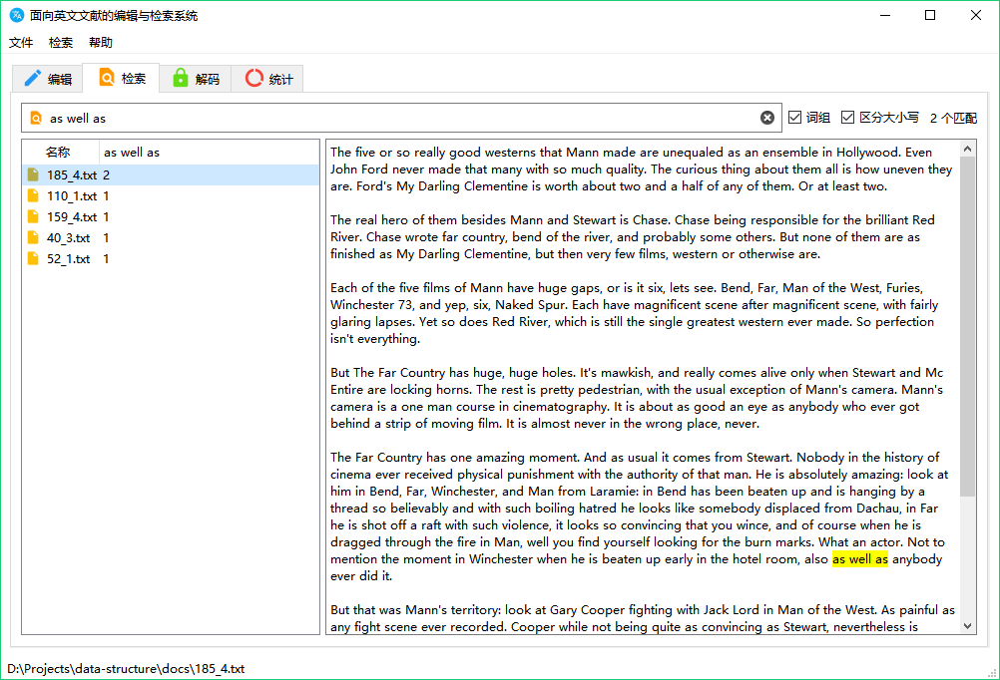
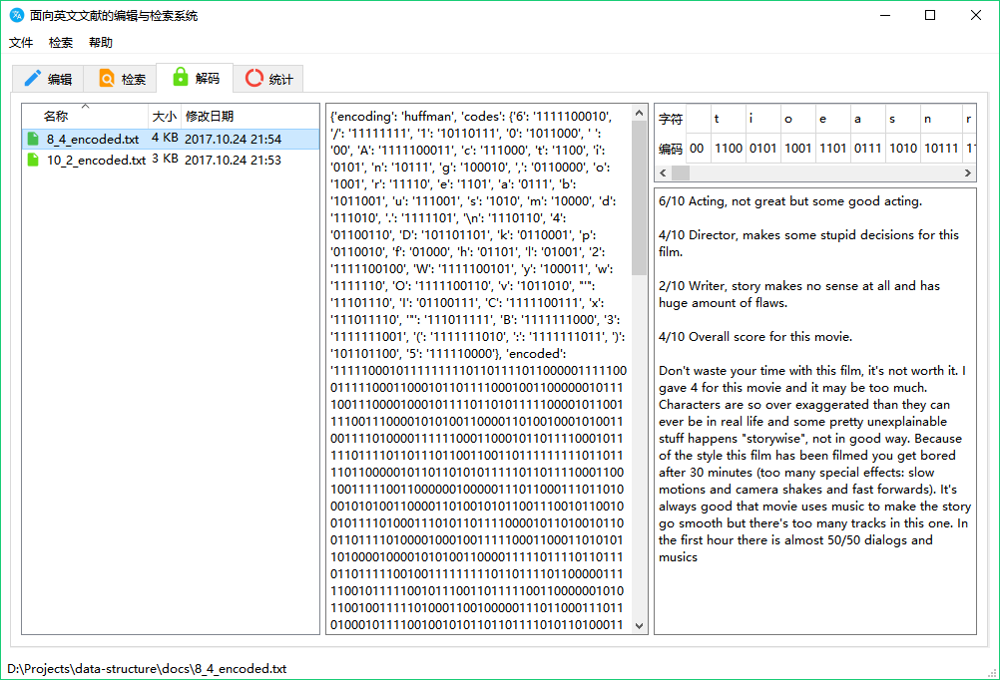
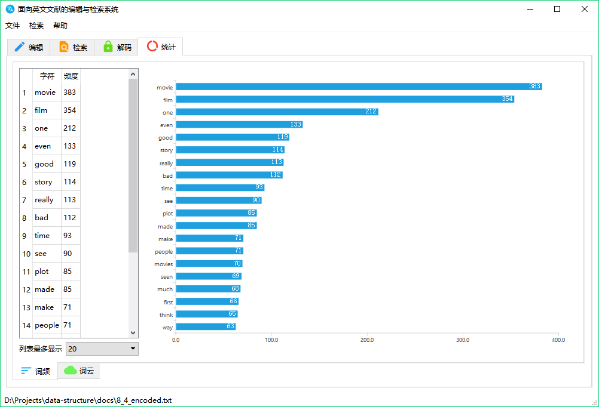
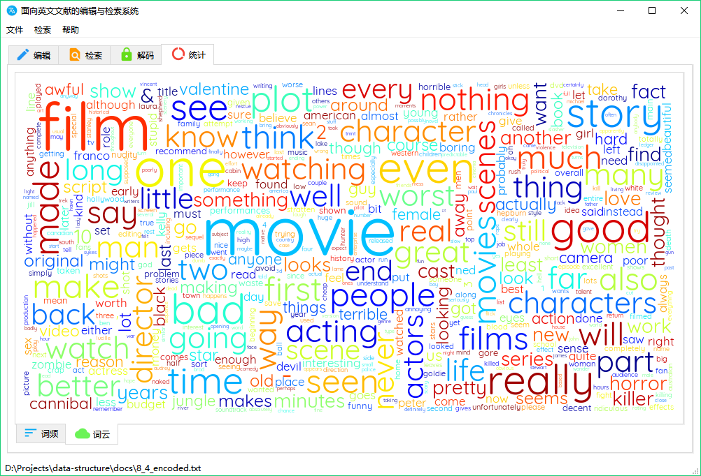

# Data Structure
An editor and search engine for English documents.

## Prerequisites
- Latest Windows, macOS or Linux
- Python 3.6 and `pip install -r requirements.txt`
- Graphviz 2.38

## Usage
Run `python app.py`.

## Packaged version
For Windows only. See [Releases](https://github.com/yunv/data-structure/releases).
### How to build
Run `python setup.py build`.

## Screenshots

## License
GPLv3
